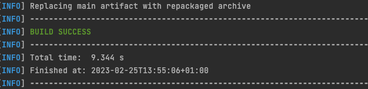
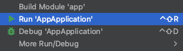
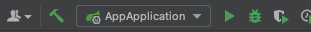
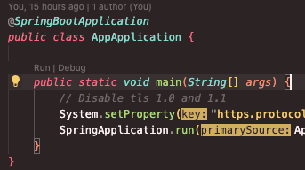
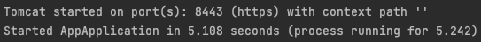

Our web app provides a online tech shop for users around the world to be able to buy the latest gear with the best reviews at the best prices. We aim to provide the best buying experience, with nice to have features such as support messages, PDF invoices, email confirmations, stock alerts and much more.

## **Team**

- Inés Alonso Izquierdo - i.alonso.2020@alumnos.urjc.es - Github: tsukii14
- Santiago Arias Paniagua - s.arias.2020@alumnos.urjc.es - Github: 4rius
- Ignacio Canículo Domínguez - i.caniculo.2020@alumnos.urjc.es - Github: nachocaniculo
- Ángel Covarrubias Roldán - a.covarrubias.2020@alumnos.urjc.es - Github: Angelcova
- Andreas Wolf Wolf - a.wolf.2020@alumnos.urjc.es - Github: Andreas4122002

## **Additional tools**

- [Miro](https://miro.com/welcomeonboard/bFFKSVBqOXhMM2NWRnNqT3NhcFNpUEV2TVd3dmdOUlRmWGs4anlVRVFpdmdzMG1mSU9QVmRZNURnemREMmpZcnwzNDU4NzY0NTM0NTA5OTk5MjM4fDI=?share_link_id=393370734333)
- [Trello](https://trello.com/invite/daw296/ATTI2056649f95538554568fdd81cacddf0800E7D919)

## **Main web app features**

Entities

| Entity | Description |
| ----------- | ----------- |
| Users | People that will be using our web app. There will be four types of users which will be explained below. All users can edit their profile, and details, including an image. |
| Products | Our users will be able to add these products to their shopping carts and wishlist. They will all have a description, an image, and different reviews. The administrator will also be able to check the stock.| 
| Purchase history | Users will be able to check their purchase history, with the timestamp of the purchase date, hour and payment method, along with the shipping address and price details. Users will be able to generate PDFs from each purchase so they can have access to their invoice. The administrator will be able to access the whole purchase history of the webpage, including details like who made the purchase.| 
| Reviews | Products will have reviews, and these reviews will be added by the users that previously bought the product. Each review will contain a five star rating, along with a comment, and the possibility of adding images. Only users who have bought the product will be able to add a review. The review will be published inmeadiately after sending it, but the administrator will be able to take it down if it contains harmful or inappropiate content.| 
| Support messages | Each user will be able to send support messages, these messages will be stored on our database, and any support personnel will be able to answer the query, this messages will be kept for as long as the query is active and will be removed after a qeury is marked as resolved by either a user or a support agent. | 

Users and their permissions

| Entity | Description |
| ----------- | ----------- |
| **Admin** - **Site owner**|  This user will be able to add new products, manage stock and purchases and remove products, as well as moderating reviews. This entity owns the whole website and can make changes to any other entities excluding support messages, which are only owned by support agents and users.  |
| **Support** | These users will see and answers all complaints from the registered customers. These users won't be able to make purchases, use the cart or the wishing list, they will be able to browse the web as usual but their actions will be limited to replying to customer queries. They own the support messages entity, and they can manage their own profile | 
| **Registered customer** | These users will be able to make purchases, add products to a wishlist, use the shopping cart, add reviews (they will also be able to delete their own reviews), view their purchase history, generate invoices and contact support. They own their own entity and can modify their user as much as they want, they can also modify the support message entity, marking a query as solved, or creating one, adding a new table to the database.  | 
| **Guest** | These users will be able to browse the whole website, but their reach will be limited and they won't be able to make purchases, contact support, or have any wishlist. They will be able to have a shopping cart which they will preserve if they register later. They won't own any entity and won't be able to modify any entity. They are only allowed to create a new user entity, registering on our website. | 

Images

| Entity | Description |
| ----------- | ----------- |
| Users | This entity includes the user profile picture, this image can be uploaded by the user |
| Products | The products will contain one or more pictures of the product we are selling, these pictures can only be uploaded by the administrator.| 
| Purchase history | The purchase history will contain a thumbnail of the product the user bought, this will be the same image as the product's main image| 
| Reviews | Users adding reviews will be able to upload up to 3 photos of the product, no one will be able to change these photos once the review is submitted.| 

Charts

Our web app will include 2 types of charts, the first one will be available for anyone, it will be a price history chart and it will be shown on each product, this is a type of line chart.
The other chart will be a bar chart showing the quantities sold each day for the last week for the administrator.

Complementary technologies

- Invoice generator: Each user will be able to download a PDF invoice of their purchases.

- Automatic emails: Users will receive notification emails when they register and when they make purchases on our website.

- Stock notifications: Users will be able to receive a notification on the website when they toogle the let me know when there's stock button on our out of stock products.

- Support notifications: If a support agent replies to a customer, this customer will have a notification on his dashboard.

- Use of Google Maps for the user to be able pin point his location, avoiding the trouble of inputting all the address details.

Algorithm

The algorithm used on our web app will be a simple recommendation algorithm, which will recommend products to our users while they are browsing our web page, according to different factors like their history, their wishlist, their recent purchases or their cart.

 

## **Navigation and models**

<b>Screenshots</b>

*We have developed all our pages from scratch using Bootstrap, if everything works out as planned, our model should be completely responsive, as we have used Bootstrap's grid system. But we will have to start developing the web app itself to know if the model is really responsive.*

#### **Home page**

*We aim to provide a simple, yet enjoyable, shopping experience, with a few featured items running on a carousel in the middle of the website, as well as some recommendations beneath it, we aim to have at least 2 rows of products, but this is just the model.*

 <b> Login </b> 

*A simple login page for the user to be able to authenticate, this allows the administrator and the support agents to login as well*

 <b> Sign up </b> 

*Another simple sign up page, where new users can sign up. Administrators and support agents have to be manually added into the system, so they won't be able to sign up using this form*

 <b> Purchase history </b> 

*Our website will let the user know all the purchases he/she has done, as well as getting further assistance, leaving a review, returning the product, or cancelling an order that has recently been made. This history is similar to the one that will be accesible for the administrator. We will also provide a unique ID for each order.*

 <b> Add review </b> 

*Our users will be able to leave reviews that include a title, a comment, and some photos*

 <b> Product view </b> 

*A view where clients can check out photos, specifications and reviews on a product. They will feature a review, and the rest of them will be available before. Note that this is just a model, and our products will include all their information in English.*

 <b> Confirmation </b> 

*A simple message confirming a purchase providing a unique identifier*

 <b> Error </b> 

*A simple error page*

 <b> Checkout </b> 

*An easy checkout for users to complete their purchases*

 <b> Shopping cart </b> 

*Clients will be able to add quantities and get errors if there is no stock left, as well as continuing to checkout*

 <b> Search results </b> 

*How we plan our products to be displayed when a user performs a search*

 <b> Review history </b> 

*How the administrator will be able to moderate reviews*

 <b> Edit profile </b> 

*The user will be able to change anything on its profile*

 <b> Add produtcs </b> 

*The administrator will be able to upload new products, that will become available for everyone browsing the website the moment the form is submitted. We will add the option to add "tags" so the recommendation algorithm can start rolling out the product to select clients.*

 <b> Edit product </b> 

*The administrator will be able to access this tool to update the product's price, as well as name, description, photos...*

 <b> Support messages </b> 

*Users will be able to chat live or leave a conversation opened with a support agent on their messages tab*

 <b> Admin dashboard </b> 

*A set of tools for the admin to be able to track the progress of the website, as well as editing and adding products, and modding reviews. The administrator will also be able to access a graph that will show the number of orders that were created the last week.*

---

<b>Diagram</b>

 
*The diagram shows how the user will be able to move throughout our website, all the screenshots can be found on the tab before, as the diagram was not comprehensible using thumbnails, as our website includes several administrator tools and other features that made it impossible to read.*

 

# **Our Web app**
## New navigation diagram
We'll add it here once we're done

## Building and running our web app

We provide instructions to build and run a complete .jar package including all the necessary dependencies, as well as running the web app from an IDE or from the command line.
Note: We don't provide instructions to build a .war file, as we believe that the .jar file is more convenient for this project as we don't need to deploy it on a server, and we will use Docker when we deploy it on a server anyway.
 
For this guide to work, you need to have the following installed:
- [Java 17](https://docs.aws.amazon.com/corretto/latest/corretto-17-ug/downloads-list.html) *(We use Corretto 17, but any other OpenJDK 17 distribution should work, we use Corretto because Amazon provides it, and it's a trusted source)*
- [Maven](https://maven.apache.org/download.cgi) *(We recommend installing it from your package manager (brew, pacman, apt), or let your IDE do it for you)*
- [Git](https://git-scm.com/downloads) *(You can also use the GitHub Desktop app)*
- Access to our database (We will provide the credentials, URL, ports and allow the IP addresses of the machines that will be accessing the database)
- Access to a terminal
- Access to a web browser (We have tested [Firefox](https://www.mozilla.org/en-US/firefox/new/) and some [Chromium](https://www.chromium.org/getting-involved/download-chromium) based browsers, it should work on anything)
- Access to our [GitHub repository](https://github.com/CodeURJC-DAW-2022-23/webapp11)

Optional:
- [IntelliJ IDEA Ultimate](https://www.jetbrains.com/idea/download/)
- [VS Code](https://code.visualstudio.com/download)

 <b> Building a .jar using mvn and running it from the command line <i>(recommended)</i> </b> 

1. Clone the repository: `git clone https://github.com/CodeURJC-DAW-2022-23/webapp11.git`
2. Navigate to the project's root directory: `cd webapp11/backend/app`, this is where the `pom.xml` file is located
3. Build the .jar file: `mvn clean package`
   - If everything goes well, you should see something like this:
      
4. Run the .jar file: `java -jar target/app-0.0.1-SNAPSHOT.jar`
5. Go to `https://localhost:8443/` to see the web app running
6. To stop the web app, press `Ctrl+C` on the terminal
- To run the web app in the background, run `java -jar target/app-0.0.1-SNAPSHOT.jar &` instead of step 4
- To stop the web app, run `kill $(lsof -t -i:8443)` on the terminal
  - To run the web app on a different port, run `java -jar target/app-0.0.1-SNAPSHOT.jar --server.port=XXXX` instead of step 4, where `XXXX` is the port you want to use, we use 8443 because it's the default port for HTTPS when using Spring Boot in development mode.
  - To stop the web app, run `kill $(lsof -t -i:XXXX)` on the terminal, where `XXXX` is the port you used to run the web app

 <b> Running the app from an IDE <i>(easier)</i> </b> 

We recommend using IntelliJ Idea Ultimate, as it's the IDE we use to develop the web app, and it's the one we're most familiar with, but you can use any IDE you want, as long as it supports Maven projects.

 <b> Using IntelliJ Idea Ultimate </b> 

1. Open the project in IntelliJ Idea Ultimate, clone the repository if you haven't already: `git clone https://github.com/CodeURJC-DAW-2022-23/webapp11.git`
2. IntelliJ will automatically detect the project as a Maven project, and will ask you if you want to import it, click on `Import Maven Projects`
3. Once the project is imported, navigate to the `AppApplication.java` file, located at `backend/app/src/main/java/com/techmarket/app/AppApplication.java`
4. Right click on the file and click on `Run 'AppApplication'`

    
5. Go to `https://localhost:8443/` to see the web app running
6. To stop the web app, press the stop button in the top right corner of the IDE or on the bottom left side of the console
- If your IDE is properly configured, you can also run the web app from the top right corner of the IDE, by clicking on the green play button next to the `AppApplication` class

  

 <b> Visual Studio Code </b> 

This steps assume you have the Java Extension Pack and the Spring Boot Extension Pack installed on Visual Studio Code.
1. Open the project in Visual Studio Code, clone the repository if you haven't already: `git clone https://github.com/CodeURJC-DAW-2022-23/webapp11.git`
2. Navigate to the `AppApplication.java` file, located at `backend/app/src/main/java/com/techmarket/app/AppApplication.java`
3. The editor should show a `Run` button above the `main` method, click on it (you can also press the Play button in the top right corner of the editor assuming you have the Spring Boot Extension Pack installed)
   
    
4. Go to `https://localhost:8443/` to see the web app running
5. To stop the web app, press the stop button in the floating menu bar that will appear at the top of the screen, or press `Ctrl+C` on the terminal

 <b> Running the app from the command line <i>(faster)</i> </b> 

1. Clone the repository: `git clone https://github.com/CodeURJC-DAW-2022-23/webapp11.git`
2. Navigate to the project's root directory: `cd webapp11/backend/app`, this is where the `pom.xml` file is located
3. Run the app: `mvn spring-boot:run`
   - If everything goes well, you should see something like this:
      
       
4. Navigate to `https://localhost:8443/` to see the web app running
5. To stop the web app, press `Ctrl+C` on the terminal
6. To run the web app in the background, run `mvn spring-boot:run &` instead of step 3
7. To stop the web app, run `kill $(lsof -t -i:8443)` on the terminal
  - To run the web app on a different port, run `mvn spring-boot:run -Dspring-boot.run.arguments=--server.port=XXXX` instead of step 3, where `XXXX` is the port you want to use, we use 8443 because it's the default port for HTTPS when using Spring Boot in development mode.
  - To stop the web app, run `kill $(lsof -t -i:XXXX)` on the terminal, where `XXXX` is the port you used to run the web app

