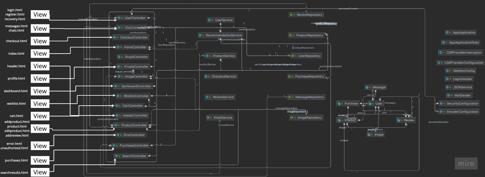

Our web app provides a online tech shop for users around the world to be able to buy the latest gear with the best reviews at the best prices. We aim to provide the best buying experience, with nice to have features such as support messages, PDF invoices, email confirmations, stock alerts and much more.

## **Team**

- Inés Alonso Izquierdo - i.alonso.2020@alumnos.urjc.es - Github: tsukii14
- Santiago Arias Paniagua - s.arias.2020@alumnos.urjc.es - Github: 4rius
- Ignacio Canículo Domínguez - i.caniculo.2020@alumnos.urjc.es - Github: nachocaniculo
- Ángel Covarrubias Roldán - a.covarrubias.2020@alumnos.urjc.es - Github: Angelcova
- Andreas Wolf Wolf - a.wolf.2020@alumnos.urjc.es - Github: Andreas4122002

## **Additional tools**

- [Miro](https://miro.com/welcomeonboard/bFFKSVBqOXhMM2NWRnNqT3NhcFNpUEV2TVd3dmdOUlRmWGs4anlVRVFpdmdzMG1mSU9QVmRZNURnemREMmpZcnwzNDU4NzY0NTM0NTA5OTk5MjM4fDI=?share_link_id=393370734333)
- [Trello](https://trello.com/invite/daw296/ATTI2056649f95538554568fdd81cacddf0800E7D919)

## **Main web app features**


<details><summary>Entities</summary>

| Entity | Description |
| ----------- | ----------- |
| Users | People that will be using our web app. There will be four types of users which will be explained below. All users can edit their profile, and details, including an image. |
| Products | Our users will be able to add these products to their shopping carts and wishlist. They will all have a description, an image, and different reviews. The administrator will also be able to check the stock.| 
| Purchase history | Users will be able to check their purchase history, with the timestamp of the purchase date, hour and payment method, along with the shipping address and price details. Users will be able to generate PDFs from each purchase so they can have access to their invoice. The administrator will be able to access the whole purchase history of the webpage, including details like who made the purchase.| 
| Reviews | Products will have reviews, and these reviews will be added by the users that previously bought the product. Each review will contain a five star rating, along with a comment, and the possibility of adding images. Only users who have bought the product will be able to add a review. The review will be published inmeadiately after sending it, but the administrator will be able to take it down if it contains harmful or inappropiate content.| 
| Support messages | Each user will be able to send support messages, these messages will be stored on our database, and any support personnel will be able to answer the query, this messages will be kept for as long as the query is active and will be removed after a qeury is marked as resolved by either a user or a support agent. | 

</details>

<details><summary>Users and their permissions</summary>

| Entity | Description |
| ----------- | ----------- |
| **Admin** - **Site owner**|  This user will be able to add new products, manage stock and purchases and remove products, as well as moderating reviews. This entity owns the whole website and can make changes to any other entities excluding support messages, which are only owned by support agents and users.  |
| **Support** | These users will see and answers all complaints from the registered customers. These users won't be able to make purchases, use the cart or the wishing list, they will be able to browse the web as usual but their actions will be limited to replying to customer queries. They own the support messages entity, and they can manage their own profile | 
| **Registered customer** | These users will be able to make purchases, add products to a wishlist, use the shopping cart, add reviews (they will also be able to delete their own reviews), view their purchase history, generate invoices and contact support. They own their own entity and can modify their user as much as they want, they can also modify the support message entity, marking a query as solved, or creating one, adding a new table to the database.  | 
| **Guest** | These users will be able to browse the whole website, but their reach will be limited and they won't be able to make purchases, contact support, or have any wishlist. They will be able to have a shopping cart which they will preserve if they register later. They won't own any entity and won't be able to modify any entity. They are only allowed to create a new user entity, registering on our website. | 

</details>

<details><summary>Images</summary>

| Entity | Description |
| ----------- | ----------- |
| Users | This entity includes the user profile picture, this image can be uploaded by the user |
| Products | The products will contain one or more pictures of the product we are selling, these pictures can only be uploaded by the administrator.| 
| Purchase history | The purchase history will contain a thumbnail of the product the user bought, this will be the same image as the product's main image| 
| Reviews | Users adding reviews will be able to upload up to 3 photos of the product, no one will be able to change these photos once the review is submitted.| 

</details>


<details><summary>Charts</summary>

Our web app will include 2 types of charts, the first one will be available for anyone, it will be a price history chart and it will be shown on each product, this is a type of line chart.
The other chart will be a bar chart showing the quantities sold each day for the last week for the administrator.

</details>

<details><summary>Complementary technologies</summary>
<p>
- Invoice generator: Each user will be able to download a PDF invoice of their purchases.
</p>
<p>
- Automatic emails: Users will receive notification emails when they register and when they make purchases on our website.
</p>
<p>
- Stock notifications: Users will be able to receive a notification on the website when they toogle the let me know when there's stock button on our out of stock products.
</p>
<p>
- Support notifications: If a support agent replies to a customer, this customer will have a notification on his dashboard.
</p>
<p>
- Use of Google Maps for the user to be able pin point his location, avoiding the trouble of inputting all the address details.
</p>

</details>


<details><summary>Algorithm</summary>

The algorithm used on our web app will be a simple recommendation algorithm, which will recommend products to our users while they are browsing our web page, according to different factors like their history, their wishlist, their recent purchases or their cart.

</details>

<br>

## **Navigation and models**

<details><summary><b>Screenshots</b></summary>

*We have developed all our pages from scratch using Bootstrap, if everything works out as planned, our model should be completely responsive, as we have used Bootstrap's grid system. But we will have to start developing the web app itself to know if the model is really responsive.*

#### **Home page**


*We aim to provide a simple, yet enjoyable, shopping experience, with a few featured items running on a carousel in the middle of the website, as well as some recommendations beneath it, we aim to have at least 2 rows of products, but this is just the model.*

<details><summary> <b> Login </b> </summary>


*A simple login page for the user to be able to authenticate, this allows the administrator and the support agents to login as well*
</details>
<details><summary> <b> Sign up </b> </summary>


*Another simple sign up page, where new users can sign up. Administrators and support agents have to be manually added into the system, so they won't be able to sign up using this form*
</details>

<details><summary> <b> Purchase history </b> </summary>


*Our website will let the user know all the purchases he/she has done, as well as getting further assistance, leaving a review, returning the product, or cancelling an order that has recently been made. This history is similar to the one that will be accesible for the administrator. We will also provide a unique ID for each order.*
</details>
<details><summary> <b> Add review </b> </summary>


*Our users will be able to leave reviews that include a title, a comment, and some photos*
</details>
<details><summary> <b> Product view </b> </summary>


*A view where clients can check out photos, specifications and reviews on a product. They will feature a review, and the rest of them will be available before. Note that this is just a model, and our products will include all their information in English.*
</details>

<details><summary> <b> Confirmation </b> </summary>


*A simple message confirming a purchase providing a unique identifier*

</details>
<details><summary> <b> Error </b> </summary>


*A simple error page*

</details>
<details><summary> <b> Checkout </b> </summary>


*An easy checkout for users to complete their purchases*

</details>
<details><summary> <b> Shopping cart </b> </summary>


*Clients will be able to add quantities and get errors if there is no stock left, as well as continuing to checkout*

</details>
<details><summary> <b> Search results </b> </summary>


*How we plan our products to be displayed when a user performs a search*

</details>
<details><summary> <b> Review history </b> </summary>


*How the administrator will be able to moderate reviews*

</details>
<details><summary> <b> Edit profile </b> </summary>


*The user will be able to change anything on its profile*

</details>
<details><summary> <b> Add produtcs </b> </summary>


*The administrator will be able to upload new products, that will become available for everyone browsing the website the moment the form is submitted. We will add the option to add "tags" so the recommendation algorithm can start rolling out the product to select clients.*

</details>
<details><summary> <b> Edit product </b> </summary>


*The administrator will be able to access this tool to update the product's price, as well as name, description, photos...*

</details>
<details><summary> <b> Support messages </b> </summary>


*Users will be able to chat live or leave a conversation opened with a support agent on their messages tab*

</details>
<details><summary> <b> Admin dashboard </b> </summary>


*A set of tools for the admin to be able to track the progress of the website, as well as editing and adding products, and modding reviews. The administrator will also be able to access a graph that will show the number of orders that were created the last week.*

</details>

</details>

---

<details><summary><b>Diagram</b></summary>


<br>
*The diagram shows how the user will be able to move throughout our website, all the screenshots can be found on the tab before, as the diagram was not comprehensible using thumbnails, as our website includes several administrator tools and other features that made it impossible to read.*

</details>

<br>

# **Our Web app - Phase 2**
## New navigation diagram
The navigation is as we established on the previous phase, with minor tweaks, for example, we figured agents should be able to use their
account to buy products, and the admin shouldn't have access to the shopping cart, as it would be nonsense for him to buy products.
We believe the roles are clear enough, we allow the users and agents to buy products, and the admin to manage the website. All the features in
between are available for all of them, as long as they are not related to the purchase of products.
The anonymous user will be able to access the home page, the login page, the sign-up page, the search results page, the product page, and he will
need to log in to access the rest of the features.

Our website has suffered some changes, without deviating too much from the design we initially proposed, our main pages now look like this:

<details><summary><b>Home page</b></summary>


Anonymous home page, the user can access the login page, the sign-up page, the search results page, the product page, and he will need to log in to access the rest of the features.


Logged-in user, his featured offers are tailored to the products he has bought in the past.

</details>

<details><summary><b>Search results page</b></summary>


The search results page has been updated to include the load more button using AJAX.


</details>

<details><summary><b>Product page</b></summary>


The product page has been updated to include the add to cart and wishlist button, and the reviews section.
The logged-in user can now add products to his cart and wishlist, and he can also leave reviews to products he has bought.
Logged-in users can see the profile picture of the user that left the review, as well as the images of it.
Anonymous users can only see the email of the user that left the review, and the review itself.


</details>

<details><summary><b>Shopping cart page</b></summary>


The shopping cart page has been updated to include the remove from cart button and the checkout button.

</details>

<details><summary><b>Wishlist page</b></summary>


The wishlist page has been updated to include the remove from wishlist and the add to cart button.

</details>

<details><summary><b>Recent orders page</b></summary>


The recent orders page now works, and lets you return products, add reviews, contact support and download the invoice in PDF format.

</details>

<details><summary><b>Invoice</b></summary>


The invoice is now available in PDF format, and it includes the product, the total price, the shipping address, the date of the order, and the order number.

</details>

<details><summary><b>Support chat</b></summary>


The support chat now works, and lets you chat with the support agent, and leave a conversation opened.

</details>

<details><summary><b>Admin dashboard</b></summary>


The admin dashboard is new, and includes a set of tools for the admin to take a look at the progress of the website, as well as edit and add products, check price history, and mod reviews.


The admin dashboard uses AJAX to load more products.

</details>

<details><summary><b>Price history</b></summary>


The price history chart is new, and it shows the price history of a product, and it includes a button to download the chart in PNG format.
For now, it is only available for the admin, but we plan to release it for the users and agents as well.

</details>

<details><summary><b>Profile</b></summary>


The user can now change everything on his profile except for his email. He can't manually change his password from here, but can recover it using the forgot password feature.

</details>

<details><summary><b>Active support messages</b></summary>


The active support messages page is new, and it shows the people who have stared a conversation with the agents,
any agent can access any conversation and reply to it. They are ordered by timestamp, and the most recent conversation is at the top.

</details>


## Building and running our web app

We provide instructions to build and run a complete .jar package including all the necessary dependencies, as well as running the web app from an IDE or from the command line.
Note: We don't provide instructions to build a .war file, as we believe that the .jar file is more convenient for this project as we don't need to deploy it on a server, and we will use Docker when we deploy it on a server anyway.
<br>

**For this guide to work, you need to have the following installed:**
- [Java 17](https://docs.aws.amazon.com/corretto/latest/corretto-17-ug/downloads-list.html) *(We use Corretto 17, but any other OpenJDK 17 distribution should work, we use Corretto because Amazon provides it, and it's a trusted source)*
- [Maven](https://maven.apache.org/download.cgi) *(We recommend installing it from your package manager (brew, pacman, apt), or let your IDE do it for you)*
- [Git](https://git-scm.com/downloads) *(You can also use the GitHub Desktop app)*
- Access to our database (We will provide the credentials, URL, ports and allow the IP addresses of the machines that will be accessing the database)
- Access to a terminal
- Access to a web browser (We have tested [Firefox](https://www.mozilla.org/en-US/firefox/new/) and some [Chromium](https://www.chromium.org/getting-involved/download-chromium) based browsers, it should work on anything)
- Access to our [GitHub repository](https://github.com/CodeURJC-DAW-2022-23/webapp11)

Optional:
- [IntelliJ IDEA Ultimate](https://www.jetbrains.com/idea/download/)
- [VS Code](https://code.visualstudio.com/download)
- [MySQL Server](https://dev.mysql.com/downloads/mysql/) *(We use an Azure MySQL database as it was more convenient for us, but it works on any MySQL server)*

*We use Azure's MySQL database as it was more convenient for us than having to deploy lots of objects
when testing the ajax buttons, or other features, plus it has allowed us to save time redeploying it
each time we had to test, or adding lots of products, allowing us to store them indefinitely. This was free
as part of our Microsoft Azure Subscription.*

*Either way, we provide a SampleDataService.java file that creates 3 products, 3 users and a review,
for basic testing it might come in handy, however, to test our web app and get a glimpse of what it looks like
with more products, we highly recommend running it with our database. The credentials can be found
under application.properties, and we can provide access to the IPs that will be running the app*

<details><summary> <b> Setting up a database <i>(Not recommended)</i> </b> </summary>

1. Install MySQL Server
2. Create a database with a schema called `3techmarket`
3. Change the commented lines in the `application.properties` file to match your database's credentials and comment the lines that connect the actual Azure database.

    
4. Uncomment the @PostConstruct method in the `SampleDataService.java` file

    
5. Run the web app, and it should create the tables and populate them with the sample data
</details>

<details><summary> <b> Building a .jar using mvn and running it from the command line <i>(recommended)</i> </b> </summary>

1. Clone the repository: `git clone https://github.com/CodeURJC-DAW-2022-23/webapp11.git`
2. Navigate to the project's root directory: `cd webapp11/backend/app`, this is where the `pom.xml` file is located
3. Build the .jar file: `mvn clean package`
   - If everything goes well, you should see something like this:
      
4. Run the .jar file: `java -jar target/app-0.0.1-SNAPSHOT.jar`
5. Go to `https://localhost:8443/` to see the web app running
6. To stop the web app, press `Ctrl+C` on the terminal
- To run the web app in the background, run `java -jar target/app-0.0.1-SNAPSHOT.jar &` instead of step 4
- To stop the web app, run `kill $(lsof -t -i:8443)` on the terminal
  - To run the web app on a different port, run `java -jar target/app-0.0.1-SNAPSHOT.jar --server.port=XXXX` instead of step 4, where `XXXX` is the port you want to use, we use 8443 because it's the default port for HTTPS when using Spring Boot in development mode.
  - To stop the web app, run `kill $(lsof -t -i:XXXX)` on the terminal, where `XXXX` is the port you used to run the web app

</details>
<details><summary> <b> Running the app from an IDE <i>(easier)</i> </b> </summary>

We recommend using IntelliJ Idea Ultimate, as it's the IDE we use to develop the web app, and it's the one we're most familiar with, but you can use any IDE you want, as long as it supports Maven projects.

<details><summary> <b> Using IntelliJ Idea Ultimate </b> </summary>

1. Open the project in IntelliJ Idea Ultimate, clone the repository if you haven't already: `git clone https://github.com/CodeURJC-DAW-2022-23/webapp11.git`
2. IntelliJ will automatically detect the project as a Maven project, and will ask you if you want to import it, click on `Import Maven Projects`
3. Once the project is imported, navigate to the `AppApplication.java` file, located at `backend/app/src/main/java/com/techmarket/app/AppApplication.java`
4. Right click on the file and click on `Run 'AppApplication'`

    
5. Go to `https://localhost:8443/` to see the web app running
6. To stop the web app, press the stop button in the top right corner of the IDE or on the bottom left side of the console
- If your IDE is properly configured, you can also run the web app from the top right corner of the IDE, by clicking on the green play button next to the `AppApplication` class

  

</details>

<details><summary> <b> Visual Studio Code </b> </summary>

This steps assume you have the Java Extension Pack and the Spring Boot Extension Pack installed on Visual Studio Code.
1. Open the project in Visual Studio Code, clone the repository if you haven't already: `git clone https://github.com/CodeURJC-DAW-2022-23/webapp11.git`
2. Navigate to the `AppApplication.java` file, located at `backend/app/src/main/java/com/techmarket/app/AppApplication.java`
3. The editor should show a `Run` button above the `main` method, click on it (you can also press the Play button in the top right corner of the editor assuming you have the Spring Boot Extension Pack installed)
   
    
4. Go to `https://localhost:8443/` to see the web app running
5. To stop the web app, press the stop button in the floating menu bar that will appear at the top of the screen, or press `Ctrl+C` on the terminal

</details>
</details>

<details><summary> <b> Running the app from the command line <i>(faster)</i> </b> </summary>

1. Clone the repository: `git clone https://github.com/CodeURJC-DAW-2022-23/webapp11.git`
2. Navigate to the project's root directory: `cd webapp11/backend/app`, this is where the `pom.xml` file is located
3. Run the app: `mvn spring-boot:run`
   - If everything goes well, you should see something like this:
      
       
4. Navigate to `https://localhost:8443/` to see the web app running
5. To stop the web app, press `Ctrl+C` on the terminal
6. To run the web app in the background, run `mvn spring-boot:run &` instead of step 3
7. To stop the web app, run `kill $(lsof -t -i:8443)` on the terminal
  - To run the web app on a different port, run `mvn spring-boot:run -Dspring-boot.run.arguments=--server.port=XXXX` instead of step 3, where `XXXX` is the port you want to use, we use 8443 because it's the default port for HTTPS when using Spring Boot in development mode.
  - To stop the web app, run `kill $(lsof -t -i:XXXX)` on the terminal, where `XXXX` is the port you used to run the web app

</details>

## Diagrams
<details><summary> <b> Entity Relationship Diagram (ERD) </b> </summary>
Please bear in mind that many of the relationships represent lists, our database may
appear like we have lots of entities, are actually just one entity with a list of objects. Some of the
relationships overlap on the diagram, to read the diagram, please follow the arrows and read
how the entities are related, comparing the diagram with the code will help you understand it.


</details>

<details><summary> <b> Class and templates diagram </b> </summary>



</details>

## Contributions

All members have contributed to the project in a similar way, and all members have worked on all parts of the project, this table is just a rough estimate of the amount of work each member has done.

| Member                                               | Contributions                                                                                                                                                                             |
|------------------------------------------------------|-------------------------------------------------------------------------------------------------------------------------------------------------------------------------------------------|
| [Santiago Arias](https://github.com/4rius)           | Spring security - All AJAX request buttons - Cart - Purchase history - Image handling - Product search - Automatic emails - Support messages - Entities - Add reviews - Database Handling |
| [Andreas Wolf](https://github.com/Andreas4122002)    | Checkout - Wishlist - Edit profile - Edit product - Admin dashboard - Entities - Spring Security -Database setup - Database Handling - Repositories                                       |
| [Ignacio Canículo](https://github.com/nachocaniculo) | Add product - Price history chart - Email password recovery - Login - Signup                                                                                                              |
| [Inés Alonso](https://github.com/tsukii14)           | Product details - Review handling - Image handling - Thorough testing                                                                                                                     |
| [Ángel Covarrubias](https://github.com/angelcova)    | Recommendation algorithm - Home page - Thorough testing                                                                                                                                   |

### 5 most important commits

<details><summary> <b> Santiago Arias </b> </summary>

- [Finished support chat](https://github.com/CodeURJC-DAW-2022-23/webapp11/commit/adbb2af3a1d2687c3d75ad596838626ce0b51691)
- [Ajax button and cart controller](https://github.com/CodeURJC-DAW-2022-23/webapp11/commit/ddbf93d0da4b8249b3f8604d182d21388da7a4bf)
- [Headers,pageable and AJAX with JSON](https://github.com/CodeURJC-DAW-2022-23/webapp11/commit/0f55370475d94e8f47ed2c345ea3ee146af542dc#diff-1cc9442bfbec310ff7a3a5005337b137a0e1c1dde0a3ffe08258b49b34aad16d)
- [Database optimisation (reduced queries for the vast majority of tasks)](https://github.com/CodeURJC-DAW-2022-23/webapp11/commit/fd8278e475a8d64609f27dd5edb72e5dadb21f65)
- [Email confirmation when signing up](https://github.com/CodeURJC-DAW-2022-23/webapp11/commit/5788d318549cb70423c3e8dd691a622316ae3238)

</details>

<details><summary> <b> Andreas Wolf </b> </summary>


- [Finished checkout](https://github.com/CodeURJC-DAW-2022-23/webapp11/commit/4ebf78d6763c5b0ade3cf38028da24c025e8073a)
- [Product editing fully functional](https://github.com/CodeURJC-DAW-2022-23/webapp11/commit/de0415e11d5cc12375cf38ef64f9e68cd1224538)
- [Wishlist implementation](https://github.com/CodeURJC-DAW-2022-23/webapp11/commit/ed85e139feabc1700b725beaa1319ea99573db54)
- [Profile editing fully functional](https://github.com/CodeURJC-DAW-2022-23/webapp11/commit/5b49934bf0dfd2f0cc044b49cc60ffdc1a5d63da#diff-e1d022fb9241e13ef063ac1c15b1714e02354a55079e730f0a85b8c82e83a75d)
- [Admin dashboard](https://github.com/CodeURJC-DAW-2022-23/webapp11/commit/d0f5af0ca192512f97b1a8f424973a38b4ff35c0)


</details>

<details><summary> <b> Ignacio Canículo </b> </summary>

- [Price History Graph](https://github.com/CodeURJC-DAW-2022-23/webapp11/commit/5107156ec558d060502da070371418fc04ed7274)
- [Price History Graph](https://github.com/CodeURJC-DAW-2022-23/webapp11/commit/a7f0d2736882b010c2e886e5480ead8d5eb37fd5)
- [Change password](https://github.com/CodeURJC-DAW-2022-23/webapp11/commit/c14da855068dd8039b1206e1311de1f65a02205f)
- [Password toogle visibility and editproduct advances](https://github.com/CodeURJC-DAW-2022-23/webapp11/commit/44bb3ab5ddf7afda539096bc0a281bf7ee3764d8)
- [Working version of admin product adder](https://github.com/CodeURJC-DAW-2022-23/webapp11/commit/11f1c736665ee4248172b2490a88a10039d98726)

</details>

<details><summary> <b> Inés Alonso </b> </summary>

- [Review images](https://github.com/CodeURJC-DAW-2022-23/webapp11/commit/b9a463dfaeaf313ec42f03c4155c98268350e8b4)
- [Product rating stars](https://github.com/CodeURJC-DAW-2022-23/webapp11/commit/1f995e3e1bb7d27a546ce9b20b84ae9df471c381)
- [Show the other photos of the product](https://github.com/CodeURJC-DAW-2022-23/webapp11/commit/83830dcb1249a9954a3d012398d7d856c295aef3)
- [Update product view](https://github.com/CodeURJC-DAW-2022-23/webapp11/commit/bec17b927cd416f2a37495ecd56b04f0257317ba)
- [Error at product template](https://github.com/CodeURJC-DAW-2022-23/webapp11/commit/821876efd6ef75e625a28bd997efc273fb6a4124)

</details>

<details><summary> <b> Ángel Covarrubias </b> </summary>
    
- [Recommendations refactor](https://github.com/CodeURJC-DAW-2022-23/webapp11/commit/3ff044766d26450e162bbd2dd2493b13dc54fb1a)
- [Recommended products](https://github.com/CodeURJC-DAW-2022-23/webapp11/commit/074fce6d60867cae65c9cf5276f001c665dae9ff#diff-82607adf4067143c3ecd7fa4eb43cff33b549f9293579f0a40ba5c9714b05e4d)
- [Some algorithm errors fixed](https://github.com/CodeURJC-DAW-2022-23/webapp11/commit/2a2ec4012f0acfccc2147d117b9db2b794556c2b#diff-62d8fd2e53751f3d3cae52f82e0cd8f3ed87ab4ef25ce26f2c8d3be019c0a3e3)
- [Recommendation algorithm fix](https://github.com/CodeURJC-DAW-2022-23/webapp11/commit/dbe953d2d766617f9f4b1e4730c428a548f4ea21#diff-8ee70ef5ad0b0383cd723ccf16bc5c27c4da071c7b63de1ff2458b06d62c1def)
- [Update recommendation algorithm](https://github.com/CodeURJC-DAW-2022-23/webapp11/commit/fca38df21321509047d4fee5d88d5c1f5a6b539e)
    
</details>

### 5 most edited files

<details><summary> <b> Santiago Arias </b> </summary>

- [ProductController.java](https://github.com/CodeURJC-DAW-2022-23/webapp11/blob/main/backend/app/src/main/java/com/techmarket/app/controller/ProductController.java)
- [CartController.java](https://github.com/CodeURJC-DAW-2022-23/webapp11/blob/development/backend/app/src/main/java/com/techmarket/app/controller/CartController.java)
- [ajaxsearch.js](https://github.com/CodeURJC-DAW-2022-23/webapp11/blob/main/backend/app/src/main/resources/static/ajaxsearch.js)
- [ChatController.java](https://github.com/CodeURJC-DAW-2022-23/webapp11/blob/main/backend/app/src/main/java/com/techmarket/app/controller/ChatController.java)
- [SearchController.java](https://github.com/CodeURJC-DAW-2022-23/webapp11/blob/main/backend/app/src/main/java/com/techmarket/app/controller/SearchController.java)

</details>

<details><summary> <b> Andreas Wolf </b> </summary>

- [DashboardController.java](https://github.com/CodeURJC-DAW-2022-23/webapp11/blob/main/backend/app/src/main/java/com/techmarket/app/controller/DashboardController.java)
- [ProductController.java](https://github.com/CodeURJC-DAW-2022-23/webapp11/blob/main/backend/app/src/main/java/com/techmarket/app/controller/ProductController.java)
- [CheckoutController.java](https://github.com/CodeURJC-DAW-2022-23/webapp11/blob/main/backend/app/src/main/java/com/techmarket/app/controller/CheckoutController.java)
- [PrivateController.java](https://github.com/CodeURJC-DAW-2022-23/webapp11/blob/main/backend/app/src/main/java/com/techmarket/app/controller/PrivateController.java)
- [Dashboard.html](https://github.com/CodeURJC-DAW-2022-23/webapp11/blob/development/backend/app/src/main/resources/templates/dashboard.html)


</details>

<details><summary> <b> Ignacio Canículo </b> </summary>

- [pricehistory.html](https://github.com/CodeURJC-DAW-2022-23/webapp11/blob/development/backend/app/src/main/resources/templates/pricehistory.html)
- [app.js](https://github.com/CodeURJC-DAW-2022-23/webapp11/blob/main/backend/app/src/main/resources/static/app.js)
- [ProductController.java](https://github.com/CodeURJC-DAW-2022-23/webapp11/blob/main/backend/app/src/main/java/com/techmarket/app/controller/ProductController.java)
- [UserController.java](https://github.com/CodeURJC-DAW-2022-23/webapp11/blob/main/backend/app/src/main/java/com/techmarket/app/controller/UserController.java)
- [recovery.html](https://github.com/CodeURJC-DAW-2022-23/webapp11/blob/main/backend/app/src/main/resources/templates/recovery.html)

</details>

<details><summary> <b> Inés Alonso </b> </summary>

- [ProductController.java](https://github.com/CodeURJC-DAW-2022-23/webapp11/blob/main/backend/app/src/main/java/com/techmarket/app/controller/ProductController.java)
- [ImageController.java](https://github.com/CodeURJC-DAW-2022-23/webapp11/blob/development/backend/app/src/main/java/com/techmarket/app/controller/ImageController.java)
- [product.html](https://github.com/CodeURJC-DAW-2022-23/webapp11/blob/development/backend/app/src/main/resources/templates/product.html)
- [ReviewRepository.java](https://github.com/CodeURJC-DAW-2022-23/webapp11/blob/development/backend/app/src/main/java/com/techmarket/app/Repositories/ReviewRepository.java)
- [productRate.js](https://github.com/CodeURJC-DAW-2022-23/webapp11/blob/development/backend/app/src/main/resources/static/productRate.js)

</details>

<details><summary> <b> Ángel Covarrubias </b> </summary>

- [HomeController.java](https://github.com/CodeURJC-DAW-2022-23/webapp11/blob/main/backend/app/src/main/java/com/techmarket/app/controller/HomeController.java)
- [RecommendationService.java](https://github.com/CodeURJC-DAW-2022-23/webapp11/blob/main/backend/app/src/main/java/com/techmarket/app/service/RecommendationService.java)
- [ProductRepository.java](https://github.com/CodeURJC-DAW-2022-23/webapp11/blob/main/backend/app/src/main/java/com/techmarket/app/Repositories/ProductRepository.java)
- [PurchaseRepository.java](https://github.com/CodeURJC-DAW-2022-23/webapp11/blob/main/backend/app/src/main/java/com/techmarket/app/Repositories/PurchaseRepository.java)
- [index.html](https://github.com/CodeURJC-DAW-2022-23/webapp11/blob/main/backend/app/src/main/resources/templates/index.html)    
    
</details>

# Phase 3: API REST, Docker and Railway

## Sample credentials

<details><summary> <b> If you use our database you can use the following credentials to log in </b> </summary>

- ADMIN: santi.ari.pani+admin@pm.me / 12345678
- USER: santiaripani@pm.me / 12345678
- AGENT: santi.ari.pani+agent@pm.me / 12345678

</details>

<details><summary> <b> If you use the SampleDataService </b> </summary>

- ADMIN: admin@example.com / admin123456
- USER: user@example.com / user123456
- AGENT: agent@example.com / agent123456

</details>

## API REST Documentation

As we are using SpringBoot 3, we need to use need to use [springdoc-openapi v2.0.4](https://springdoc.org/v2/) to generate the documentation. The documentation is available at `/api-docs` and `/v3/api-docs` endpoints. We also created a [Postman collection](https://rawcdn.githack.com/CodeURJC-DAW-2022-23/webapp11/f9cff813b1c2e29476acf1277ebf638527f2fd00/3TechMarket%20API.postman_collection.json) to test the API.

We provide a Yaml file with the API documentation, and a html file with the generated documentation that were made using springdoc-openapi-maven-plugin 1.4 to get the Yaml file and openapi-generator-maven-plugin to generate the HTML. You can find them on this raw [YAML file](https://rawcdn.githack.com/CodeURJC-DAW-2022-23/webapp11/f9cff813b1c2e29476acf1277ebf638527f2fd00/backend/app/api-docs/api-docs.yaml) and [HTML file](https://rawcdn.githack.com/CodeURJC-DAW-2022-23/webapp11/f9cff813b1c2e29476acf1277ebf638527f2fd00/backend/app/api-docs/index.html).

You can also access and test the API using the built-in Swagger UI provided as part of the dependency at `https://localhost:8443/api-docs`, as well as the YAML file at `https://localhost:8443/v3/api-docs.yaml`.

To create the documentation yourself you can expand the following section.

<details><summary> <b> How to generate the documentation </b> </summary>

1. Disable anything that has to do with https in the `application.properties` file (uncomment the following lines):

    

    This will make the app start in http instead of https.

2. Uncomment the following lines in the `pom.xml` file (both plugins):

    
3. Run `mvn verify` to generate the documentation

Notes: You should run the command from the root folder of the project -> `app`. If you run it from the `backend` folder it will not work. The provided documentation is already up-to-date, so you don't need to generate it again. Remember to comment the lines you uncommented in the `pom.xml` file and uncomment the lines you commented on the `application.properties` file.

</details>

## Updated class diagram


## Run the dockerized application
*We provide 2 `docker_compose.yml` files, one of them connects with our Azure database and contains lots of sample data the other one connects with a local database using the MySQL official Docker image. You can choose the one you want to use. You can add some sample data using the `SampleDataService.java` file.*

*If you don't have the image created, it will automatically be pulled from Docker Hub (it will pull the version tagged `latest`). The image is available at [https://hub.docker.com/r/4rius/threetechmarket](https://hub.docker.com/r/4rius/threetechmarket). This image was built on OS linux/arm64/v8 (Apple Silicon), so it might not work on other OS, you can create your own image using the `Dockerfile` provided in the root folder of the project, or using the `create_image.sh` script for convenience.*

<details><summary> <b> Using a local database (MySQL Docker image) </b> </summary>

1. Install Docker and Docker Compose
2. Navigate to the `docker` folder
3. Run `docker-compose up -d` to start the containers (they are configured to wait for the database to be ready)

If you want to stop the containers run `docker-compose down` and if you want to remove the images run `docker-compose down --rmi all` and if you want to remove the containers run `docker rm -f $(docker ps -aq)` (this will remove all the containers)

You can also stop a container with `docker stop <container_id>` and remove it with `docker rm <container_id>` where container_id can be either threetechmarket or 3techmarket_db

You can also run `docker-compose up` to see the logs of the containers

You can check the status of the containers with `docker ps`

If everything is ok you should see 2 containers running (database and application):


</details>

<details><summary> <b> Using our Azure database</i> </b> </summary>

1. Install Docker and Docker Compose
2. Navigate to the `docker` folder
3. Run `docker-compose -f docker-compose-azure.yml up -d` to start the containers (only one container is needed)

If you want to stop the containers run `docker-compose -f docker-compose-azure.yml down` and if you want to remove the image run `docker-compose -f docker-compose-azure.yml down --rmi all`

You can also stop the container with `docker stop threetechmarket` and remove it with `docker rm threetechmarket`

You can also run `docker-compose -f docker-compose-azure.yml up` to see the logs of the containers

You can check the status of the containers with `docker ps`

If everything is ok you should see 1 container running:


</details>

## Create the Docker image

*We provide a handy shell script to easily build and image of our app and be able to run them, however, you can manually create the image as well, but you won't be using dockerized Maven or JDK, so you will need to have them installed on your machine.*

*The provided shell script has been tested on Apple Silicon Macs and x86 Linux*

1. Clone the repository `git clone https://github.com/CodeURJC-DAW-2022-23/webapp11.git`
2. Navigate to the `docker` folder `cd webapp11/docker`
3. Run `./create_image.sh` to build the image
4. Refer to the instructions above to run the image

The image name is `4rius/threetechmarket` and the version is `1.0.0` (also tagged as `latest`)

If the bash script fails to run you may need to give it execution permissions with `chmod +x create_image.sh`

## Deploy the application to Railway through the command line (NOT WORKING / NOT TESTED / NOT REQUIRED)

1. Install the Railway CLI with your package manager of choice (brew, apt, etc.) (Example for macOS: `brew install railway`)
2. Login to Railway with `railway login`
3. Clone the repository `git clone https://github.com/CodeURJC-DAW-2022-23/webapp11.git`
4. Navigate to the project folder `cd webapp11`
5. Create a new project with `railway init`
6. Link the project with the current folder with `railway link`
7. Add the MySQL plugin with `railway add` and select the MySQL plugin
8. Run `railway up` to deploy the application

Note: This worked once and never worked again, and since it became optional we decided to not spend more time on it.

## Member participation

## Contributions

All members have contributed on this phase of the project, the following table shows the contributions of each member:

| Member                                               | Contributions                                                                                                       |
|------------------------------------------------------|---------------------------------------------------------------------------------------------------------------------|
| [Santiago Arias](https://github.com/4rius)           | API security - Product Rest controller - API Login and signup - API User images - All the Docker stuff - Springdoc  |
| [Andreas Wolf](https://github.com/Andreas4122002)    | Repository to service switch - Cart and wishlist rest controllers - API checkout - Filters - Review rest controller |
| [Ignacio Canículo](https://github.com/nachocaniculo) | API support chat (messages) - Message service optimization - Postman collection                                     |
| [Inés Alonso](https://github.com/tsukii14)           | API product images - API review images - Filters                                                                    |
| [Ángel Covarrubias](https://github.com/angelcova)    | Review rest controller - Filters - Postman collection                                                               |

### 5 most important commits

<details><summary> <b> Santiago Arias </b> </summary>

- [Dockerized the application](https://github.com/CodeURJC-DAW-2022-23/webapp11/commit/96bb579cfd63ec7499d2bff0e73edef1f6d377d4)
- [Profile picture images through the API](https://github.com/CodeURJC-DAW-2022-23/webapp11/commit/db538d85a19ddd46a2696d7032ec35ee85b9ed39)
- [API Security](https://github.com/CodeURJC-DAW-2022-23/webapp11/commit/9938af6b77574ac99498a8991a2bbb78bf172254)
- [Springdoc OpenAPI](https://github.com/CodeURJC-DAW-2022-23/webapp11/commit/3e12f37bf22a3fab076bf37e6e0c35d7ea7688fb)
- [ProductRestController](https://github.com/CodeURJC-DAW-2022-23/webapp11/commit/15a8448d22774c6ff34934f8c7ce41e48a452d49)

</details>

<details><summary> <b> Andreas Wolf </b> </summary>


- [Wishlist implementation for the API](https://github.com/CodeURJC-DAW-2022-23/webapp11/commit/9ab2b14ce7683cfa708a1709b3d45583c5fa2534)
- [Cart implementation for the API](https://github.com/CodeURJC-DAW-2022-23/webapp11/commit/b8c81304cd7180c419eec7c210b8d8fa6aa1c3b2#diff-03f48cf821b3ddde992abf5985b1e56498d4e9562d65fb363ac4167a48d6e004)
- [Checkout implementation for the API](https://github.com/CodeURJC-DAW-2022-23/webapp11/commit/ded258d81ab563d47ee8f212954fd59f46dbd0be)
- [Product Recommendation Service for the API](https://github.com/CodeURJC-DAW-2022-23/webapp11/commit/ca027d6d55f0d666aa8106424a7a2b30b9d6c5e6)
- [Purchase return implementation fdr the API](https://github.com/CodeURJC-DAW-2022-23/webapp11/commit/28e416139b8e269fd8d81b5dddc0924f9664e6c7)


</details>

<details><summary> <b> Ignacio Canículo </b> </summary>

- [Working Messages API :)](https://github.com/CodeURJC-DAW-2022-23/webapp11/commit/1d5e02a9e8471f2a29f41524925633e6183d4a17)
- [No Working Messages API](https://github.com/CodeURJC-DAW-2022-23/webapp11/commit/b7fbdeaa8fe9b5ce94a3393521e7cc2b661f79f9)
- [Working messages API](https://github.com/CodeURJC-DAW-2022-23/webapp11/commit/d2637a2348bff53370b229780ccd650f73ef199b)
- [Messages via API](https://github.com/CodeURJC-DAW-2022-23/webapp11/commit/27a75a01a5e8f13179579c9705f0fc4a159072d5)
- [Last changes of the API](https://github.com/CodeURJC-DAW-2022-23/webapp11/commit/faa2bc92ef700c6911071aa1780abffef9c3ffa5)

</details>

<details><summary> <b> Inés Alonso </b> </summary>

- [Upload product images](https://github.com/CodeURJC-DAW-2022-23/webapp11/commit/32b20ecaf9b4427733975085a8d7f721b8528fce)
- [Update ImageRestController](https://github.com/CodeURJC-DAW-2022-23/webapp11/commit/6a76dfecaeba883e3c197e04ef482f75769bbb46)
- [Delete images](https://github.com/CodeURJC-DAW-2022-23/webapp11/commit/1806c9b15c7f8c4930a62ecd069ac120f90d8103)
- [API finished](https://github.com/CodeURJC-DAW-2022-23/webapp11/commit/5afd5d517f6ac7456a66b9ef47dab5378e2218ff)
- [Last changes of the API](https://github.com/CodeURJC-DAW-2022-23/webapp11/commit/faa2bc92ef700c6911071aa1780abffef9c3ffa5)

</details>

<details><summary> <b> Ángel Covarrubias </b> </summary>

- [ReviewRestController](https://github.com/CodeURJC-DAW-2022-23/webapp11/commit/d88ff2554b3bfb4e0c411dd337a3d6c91cb0da31)
- [Update ReviewRestController](https://github.com/CodeURJC-DAW-2022-23/webapp11/commit/d5bbf409ee02f85277a0d8e6aabcb1c3a3033f6e)
- [API finished](https://github.com/CodeURJC-DAW-2022-23/webapp11/commit/5afd5d517f6ac7456a66b9ef47dab5378e2218ff)
- [API review changes](https://github.com/CodeURJC-DAW-2022-23/webapp11/commit/d40c1a763f5354202ef644ffaeace5f401602e8c)
- [Additions ReviewRestController](https://github.com/CodeURJC-DAW-2022-23/webapp11/commit/fcbf190e1e89ccbc512f9d9530aa42d99e6239d2)


</details>

### 5 most edited files

<details><summary> <b> Santiago Arias </b> </summary>

- [RestSecurityConfiguration.java](https://github.com/CodeURJC-DAW-2022-23/webapp11/blob/development/backend/app/src/main/java/com/techmarket/app/security/RestSecurityConfiguration.java)
- [ProductRestController.java](https://github.com/CodeURJC-DAW-2022-23/webapp11/blob/development/backend/app/src/main/java/com/techmarket/app/controller/RestControllers/ProductRestController.java)
- [ImageRestController.java](https://github.com/CodeURJC-DAW-2022-23/webapp11/blob/development/backend/app/src/main/java/com/techmarket/app/controller/RestControllers/ImageRestController.java)
- [RestAuthController.java](https://github.com/CodeURJC-DAW-2022-23/webapp11/blob/development/backend/app/src/main/java/com/techmarket/app/controller/RestControllers/RestAuthController.java)
- [docker-compose.yml](https://github.com/CodeURJC-DAW-2022-23/webapp11/blob/development/docker/docker-compose.yml)

</details>

<details><summary> <b> Andreas Wolf </b> </summary>

- [ProductRestController.java](https://github.com/CodeURJC-DAW-2022-23/webapp11/blob/development/backend/app/src/main/java/com/techmarket/app/controller/RestControllers/ProductRestController.java)
- [ReviewRestController.java](https://github.com/CodeURJC-DAW-2022-23/webapp11/blob/main/backend/app/src/main/java/com/techmarket/app/controller/RestControllers/ReviewRestController.java)
- [UserProductsRestController.java](https://github.com/CodeURJC-DAW-2022-23/webapp11/blob/main/backend/app/src/main/java/com/techmarket/app/controller/RestControllers/UserProductsRestController.java)
- [UserRestController.java](https://github.com/CodeURJC-DAW-2022-23/webapp11/blob/main/backend/app/src/main/java/com/techmarket/app/controller/RestControllers/UserRestController.java)
- [UserProductService.java](https://github.com/CodeURJC-DAW-2022-23/webapp11/blob/main/backend/app/src/main/java/com/techmarket/app/service/UserProductsService.java)


</details>

<details><summary> <b> Ignacio Canículo </b> </summary>

- [UserRestController.java](https://github.com/CodeURJC-DAW-2022-23/webapp11/blob/main/backend/app/src/main/java/com/techmarket/app/controller/RestControllers/UserRestController.java)
- [MessageService.java](https://github.com/CodeURJC-DAW-2022-23/webapp11/blob/main/backend/app/src/main/java/com/techmarket/app/controller/RestControllers/UserRestController.java)
- [RestSecurityConfiguration.java](https://github.com/CodeURJC-DAW-2022-23/webapp11/blob/development/backend/app/src/main/java/com/techmarket/app/security/RestSecurityConfiguration.java)
- [MessageRequest.java](https://github.com/CodeURJC-DAW-2022-23/webapp11/blob/main/backend/app/src/main/java/com/techmarket/app/security/jwt/MessageRequest.java)
    
</details>

<details><summary> <b> Inés Alonso </b> </summary>

- [ImageRestController](https://github.com/CodeURJC-DAW-2022-23/webapp11/blob/main/backend/app/src/main/java/com/techmarket/app/controller/RestControllers/ImageRestController.java)
- [ImageService](https://github.com/CodeURJC-DAW-2022-23/webapp11/blob/main/backend/app/src/main/java/com/techmarket/app/service/ImageService.java)
- [ProductRestController](https://github.com/CodeURJC-DAW-2022-23/webapp11/blob/main/backend/app/src/main/java/com/techmarket/app/controller/RestControllers/ProductRestController.java)
- [ProductRepository](https://github.com/CodeURJC-DAW-2022-23/webapp11/blob/main/backend/app/src/main/java/com/techmarket/app/Repositories/ProductRepository.java)

</details>

<details><summary> <b> Ángel Covarrubias </b> </summary>

- [ReviewRestContoller](https://github.com/CodeURJC-DAW-2022-23/webapp11/blob/main/backend/app/src/main/java/com/techmarket/app/controller/RestControllers/ReviewRestController.java)
- [ReviewService](https://github.com/CodeURJC-DAW-2022-23/webapp11/blob/main/backend/app/src/main/java/com/techmarket/app/service/ReviewService.java)
- [ReviewRepository](https://github.com/CodeURJC-DAW-2022-23/webapp11/blob/main/backend/app/src/main/java/com/techmarket/app/Repositories/ReviewRepository.java)
- [RestSecurityConfiguration](https://github.com/CodeURJC-DAW-2022-23/webapp11/blob/main/backend/app/src/main/java/com/techmarket/app/security/RestSecurityConfiguration.java)
- [ProductRestController](https://github.com/CodeURJC-DAW-2022-23/webapp11/blob/main/backend/app/src/main/java/com/techmarket/app/controller/RestControllers/ProductRestController.java)

</details>

# Phase 4: SPA and deployment

## Preparing the development environment

<details><summary> <b> Prerequisites </b> </summary>

<details><summary> Install Node.js and npm (npm v9.5.0+) </summary>

- MacOS: `brew install nodejs npm`
- Debian: `sudo apt install nodejs npm`
- Arch: `sudo pacman -S nodejs npm`
- Fedora: `sudo dnf install nodejs npm`
- Windows: [Download](https://nodejs.org/en/download/)
- [Other](https://nodejs.org/en/download/package-manager/)

</details>

<details><summary> Install Angular CLI (Angular CLI 15+) </summary>

- `npm install -g @angular/cli`

</details>

*Note we are taking into account you have all the previous requirements (even from older phases) installed and properly configured.*

</details>

Steps to follow:

1. Clone the repository: `git clone https://github.com/CodeURJC-DAW-2022-23/webapp11.git`
2. Go to the folder where the Angular project is located: `cd webapp11/frontend/3techmarket`
    
    You need to update the file located under `src/environments/environment.ts` with the correct URL of the backend server, the development environment is configured to use the following URL:
    
    ```typescript
    export const environment = {
     production: false,
     apiUrl: 'https://localhost:8443/api',
     apiPrefix: ''
     };
     ```
   
3. Install the dependencies: `npm install`
4. Run the project: `ng serve` *You have to start the backend server before, otherwise the application will not work properly. Refer to Phase 2 for more information on how to do this.*
5. Open your browser and go to `http://localhost:4200/`. You should see the application running.

## Building the SPA

Note you can use the create_image.sh script located under webapp11/docker to create the image, this will build the SPA and copy the files to the backend server, ultimately creating a docker image with the backend and the frontend already built.

If instead you want to build the SPA manually, follow the next steps:
1. Go to the folder where the Angular project is located: `cd webapp11/frontend/3techmarket`
2. Build the project: `ng build --configuration production --base-href /new/`
3. The build files will be located in the `dist` folder.
4. Copy the contents of the `dist` folder (`3techmarket`) to the `backend/app/src/main/resources/static/new` folder.

## Deployment

<details><summary> <b> Prerequisites </b> </summary>

- [Docker](https://docs.docker.com/get-docker/)
- [Docker Compose](https://docs.docker.com/compose/install/)
- [Git](https://git-scm.com/downloads)

</details>

Steps to follow:

1. ssh into the server: `ssh -i appWeb-11 vmuser@10.100.139.166`
2. Clone the repository: `git clone https://github.com/CodeURJC-DAW-2022-23/webapp11.git`
3. Go to the docker folder: `cd webapp11/docker`
4. Run the docker-compose file: `docker-compose up -d`
5. Open your browser and go to `https://10.100.139.166:8443/`. You should see the application running.
6. If you want to stop the application, run: `docker-compose down`

The SPA is accessible through the following URL: `https://10.100.139.166:8443/new`

## SPA Diagram


## Member contributions

## Contributions

All members have contributed on this phase of the project, the following table shows the contributions of each member:

| Member                                               | Contributions                                                                                                           |
|------------------------------------------------------|-------------------------------------------------------------------------------------------------------------------------|
| [Santiago Arias](https://github.com/4rius)           | Authentication - Profile - Docker script - Product search - Messages - Recent orders - Cart - Environments - Deployment |
| [Andreas Wolf](https://github.com/Andreas4122002)    | Admin dashboard - Wishlist - Review history - Edit product - Add product                                                |
| [Ignacio Canículo](https://github.com/nachocaniculo) | Signup - Password recovery - Price history - Environments - Diagrams                                                    |
| [Inés Alonso](https://github.com/tsukii14)           | Product view                                                                                                            |
| [Ángel Covarrubias](https://github.com/angelcova)    | Featured products - Add review                                                                                          |

### 5 most important commits

<details><summary> <b> Santiago Arias </b> </summary>

- [Routing](https://github.com/CodeURJC-DAW-2022-23/webapp11/commit/4530ae67ae65d18a318a921568f8c5342f39ee51)
- [CORS and login](https://github.com/CodeURJC-DAW-2022-23/webapp11/commit/4605d851b98c2d67ea7b234eda00315e30c2bc78)
- [Home and authentication](https://github.com/CodeURJC-DAW-2022-23/webapp11/commit/b7a279ad649a026ca9a063a68bace125b5d1db09)
- [Messages](https://github.com/CodeURJC-DAW-2022-23/webapp11/commit/c22d45738622aca807db176d0b9d5140b24f7226)
- [Recent orders](https://github.com/CodeURJC-DAW-2022-23/webapp11/commit/0ea20722e62e2cf082e8d615c49c8a578437b54e)

</details>

<details><summary> <b> Andreas Wolf </b> </summary>


-


</details>

<details><summary> <b> Ignacio Canículo </b> </summary>

-

</details>

<details><summary> <b> Inés Alonso </b> </summary>

-

</details>

<details><summary> <b> Ángel Covarrubias </b> </summary>

-


</details>

### 5 most edited files

<details><summary> <b> Santiago Arias </b> </summary>

- [profile.component.ts](https://github.com/CodeURJC-DAW-2022-23/webapp11/blob/main/frontend/3techmarket/src/app/profile/profile.component.ts)
- [auth.service.ts](https://github.com/CodeURJC-DAW-2022-23/webapp11/blob/main/frontend/3techmarket/src/app/services/auth.service.ts)
- [header.component.ts](https://github.com/CodeURJC-DAW-2022-23/webapp11/blob/main/frontend/3techmarket/src/app/header/header.component.ts)
- [recentorders.component.ts](https://github.com/CodeURJC-DAW-2022-23/webapp11/blob/main/frontend/3techmarket/src/app/recentorders/recentorders.component.ts)
- [create_image.sh](https://github.com/CodeURJC-DAW-2022-23/webapp11/blob/main/docker/create_image.sh)

</details>

<details><summary> <b> Andreas Wolf </b> </summary>

-

</details>

<details><summary> <b> Ignacio Canículo </b> </summary>

-

</details>

<details><summary> <b> Inés Alonso </b> </summary>

-

</details>

<details><summary> <b> Ángel Covarrubias </b> </summary>

- 

</details>